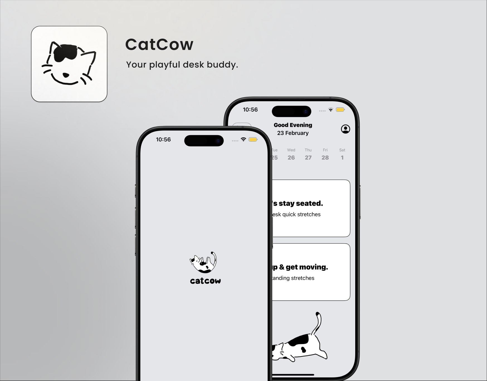

<!DOCTYPE html>
<html lang="en">
<head>
  <meta charset="UTF-8">
  <meta name="viewport" content="width=device-width, initial-scale=1">
  <title>CatCow – Your playful desk buddy.</title>
  
</head>
<body>

  <!-- HERO SECTION -->
  <section class="hero">
    

      
    

    

      <h1>CatCow — Gentle Stretch Breaks.</h1>
      
<strong>Your playful desk buddy.</strong>

      

        CatCow helps desk users relieve neck and back tension through short,
        intentional stretching routines — right at your desk or just a few steps away.
      

      <a class="button" href="mailto:catcow.app@gmail.com">Contact Support</a>
    

  </section>

  <!-- FEATURES SECTION -->
  <section class="section">
    <h2>What CatCow Offers</h2>
    <ul>
      <li> Seated, at-desk stretches for busy workdays</li>
      <li> Standing routines for a deeper reset</li>
      <li> Gentle reminders — never intrusive</li>
      <li> Designed to ease neck, shoulder, and back tension</li>
      <li> A playful kitty guide that makes movement feel rewarding</li>
    </ul>
  </section>

  <!-- FAQ SECTION -->
  <section class="section">
    <h2>FAQs</h2>
    

      <strong>Q: Do I need any equipment?</strong> 
      A: No. All stretches are bodyweight and designed for desk or nearby spaces.
    

    

      <strong>Q: Is CatCow a medical app?</strong> 
      A: No. CatCow is a lifestyle and wellness app and does not provide medical advice.
    

  </section>

  <!-- PRIVACY POLICY LINK -->
  <section class="section">
    <h2>Privacy Policy</h2>
    

      CatCow respects your privacy. No personal data is collected or shared.
      <a href="privacy.html">View our full policy</a>.
    

  </section>

</body>
</html>
